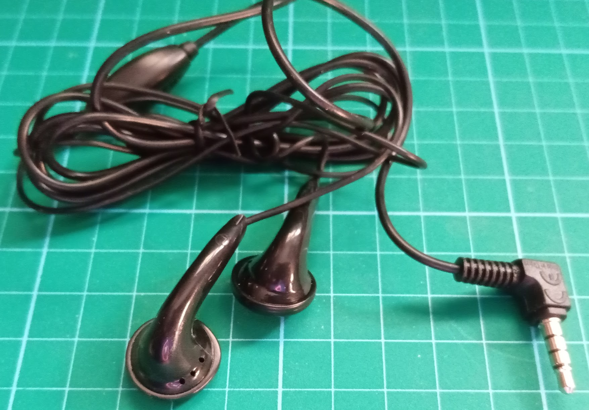
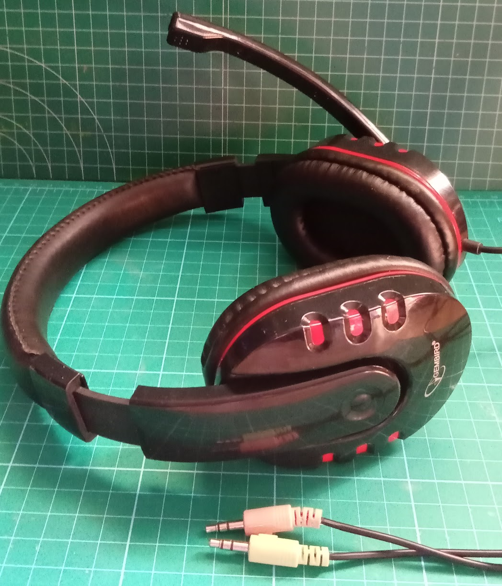
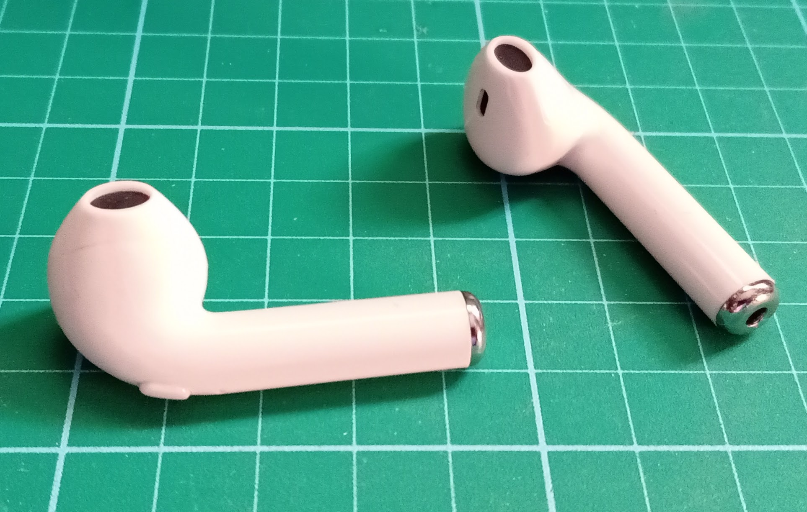
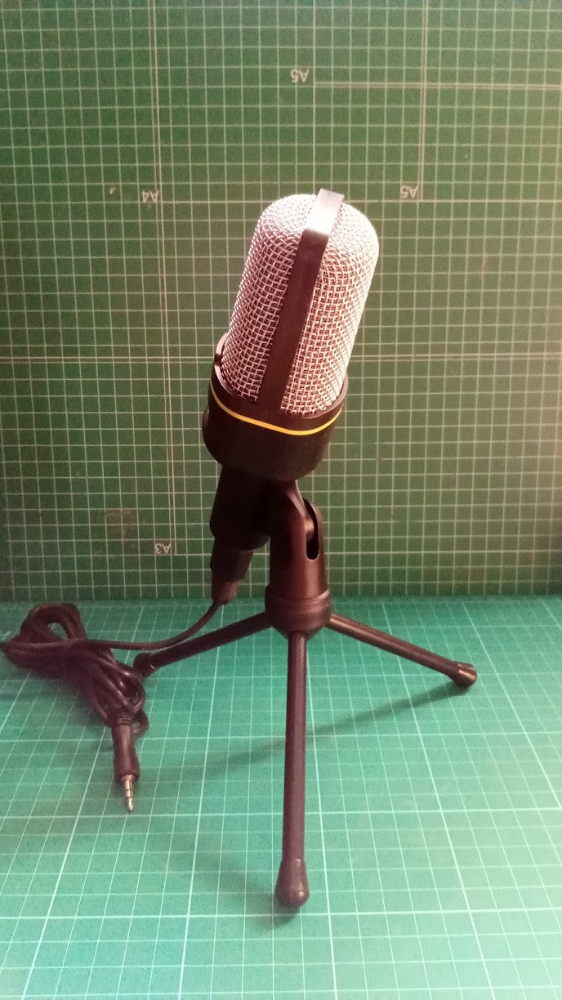
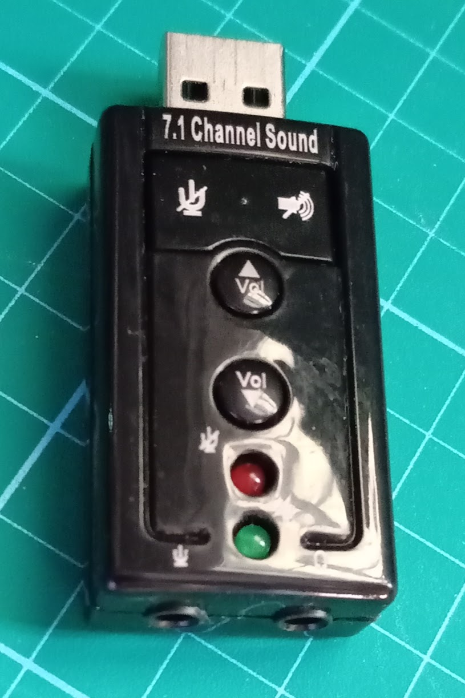

# Recursos materiales

Como base para realizar las tareas usaremos un ordenador con sistema operativo Windows, Mac ó Linux

Dado que algunos de los participantes lo tienen, también veremos herramientas que permiten hacer las tareas usando iPad

## Dispositivos de grabación

Para la grabación de contenidos podemos usar la cámara y el micrófono del portátil,  o un móvil, tablet o una cámara si la tenemos.

* Una opción sencilla es usar unos auriculares típicos de móvil que dispongan de micro. Se les distingue porque la clavija tiene 4 bloques metálicos.

* Cascos con micrófono cerca de la boca: son los que yo uso. Al ser unos cascos grandes aíslan muy bien del ruido exterior y el micro siempre está cerca de la boca con lo que no se aprecian los movimientos

* Para grabarse uno mismo podemos usar unos auriculares de móvil con bluetooth. Muy cómodos porque no se aprecian los movimivientos que hacemos con la cabeza y suelen tener buena calidad

Para mejorar la calidad de las grabaciones podemos usar distintos dispositivos:

* Micrófonos de mejor calidad, muy útiles cuando son varias las personas que van a hablar y se van a grabar a la vez. Tiene el inconveniente de que al ser omnidireccional puede captar más ruido

* Tarjeta de sonido USB: si nuestro ordenador no tiene una buena tarjeta de sonido podemos adquirir un dispositivo usb que nos permite conectar nuestros casos exteriores y suelen disponer de unos botones para silenciar los altavoces o el micro, controlar el volumen, ...

También podemos usar una grabadora digital que permite exportar los ficheros de audio.

Personalmente uso unos cascos con micrófono cerca de la boca y una tarjeta de sonido USB. Con esa combinación consigo una buena calidad y un sonido muy homogéneo.

