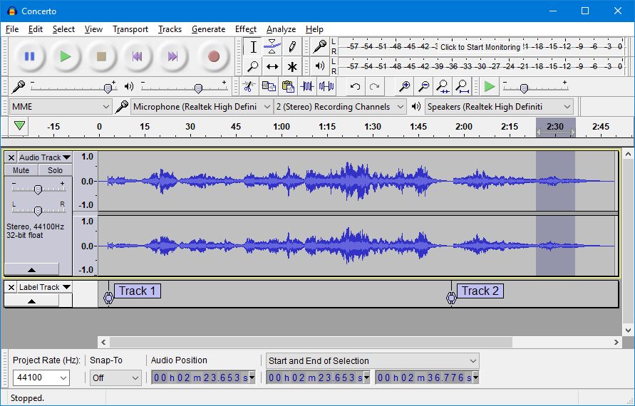
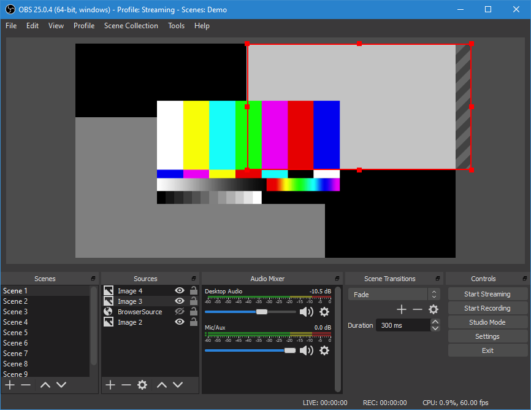

## Software necesario

Software y Aplicaciones

Todas las aplicaciones recomendadas serán gratuitas y estarán disponibles para Windows, MacOs, Linux y Android. Las herramientas tendrán licencia OpenSource para minimizar los costes y contribuir a la soberanía tecnológica

En concreto usaremos:

* [Audacity](https://www.audacityteam.org/) para la grabación y edición de audio

    

* [Open Shot](https://www.openshot.org/es/download/) para la edición de vídeo

    

* [OBS Studio](https://obsproject.com/es) para preparar videoconferencias o grabación de videotutoriales

    

También se comentarán algunas alternativas para Ipad y tablets (como VideoMaker o KineMaster) así como las herramientas que ya vienen incluidas en los ordenadores Mac como son **iMovie** o **GarageBand**

[Vídeo: Software y primeras pruebas](https://youtu.be/g8gs0FVU9Tk)

## Compartiendo ficheros entre sistemas

Podemos usar nuestro tablet o móvil para grabarnos, tanto audio como vídeo. Posteriormente editaremos estas grabaciones en el PC o en otro dispositivos. Por eso es necesario que sepamos cómo compartir entre distintos equipos esos ficheros.

La forma más sencilla de acceder a los ficheros de un móvil o tablet es conectarlo mediante un cable USB.

En clases posteriores veremos cómo hacerlo usando otras herramientas como son Google Drive.

En este vídeo vemos como hacer este proceso, para usar los ficheros en el PC.

[Vídeo: Cómo compartir ficheros entre móvil y PC](https://youtu.be/ctGt_MBTDik)
