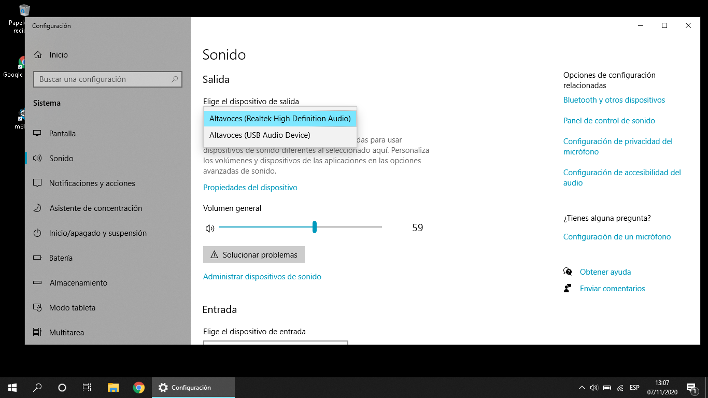
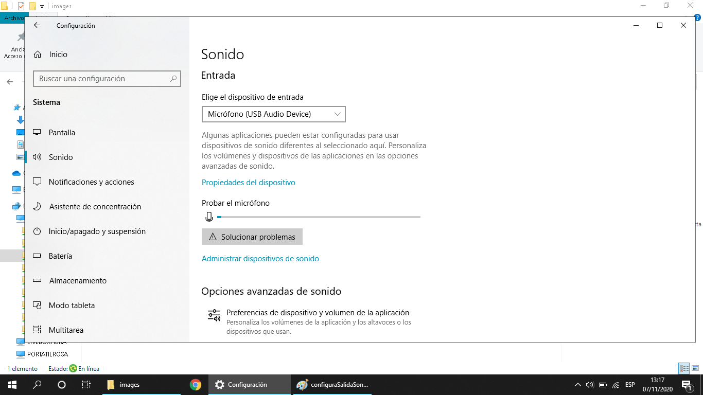
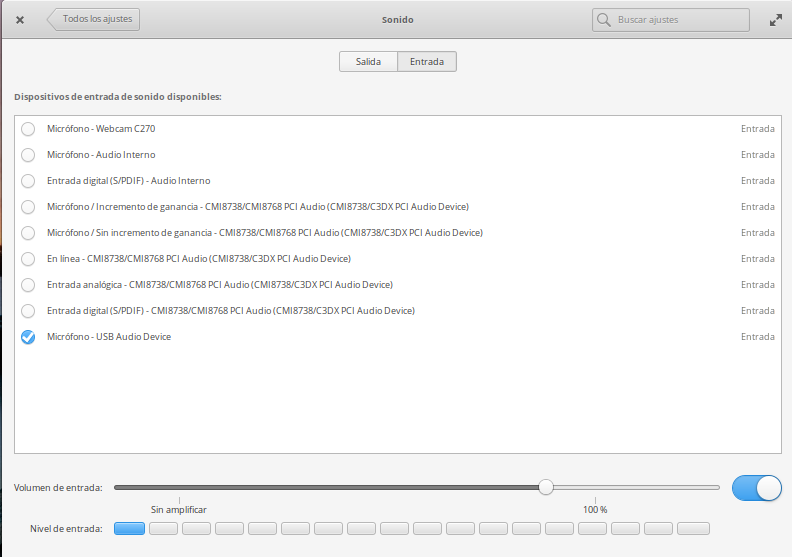
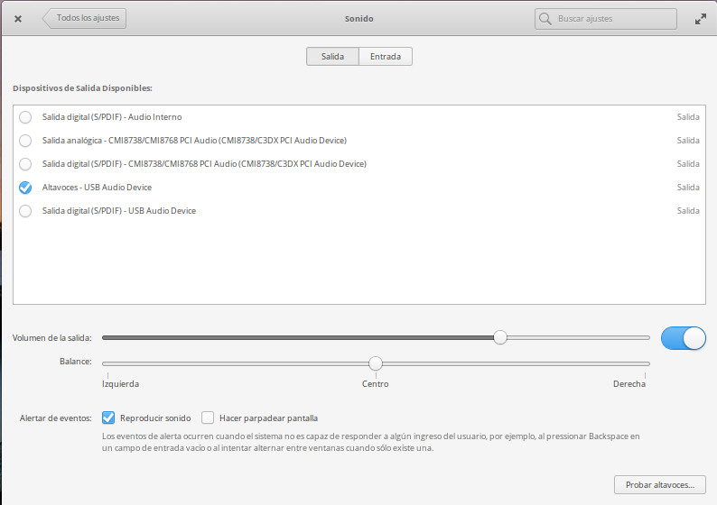

## Formatos de ficheros

* wav: disponible en todos los sistemas. El sonido es igual al original. Da lugar a ficheros muy grandes.
* mp3: el más utilizado. Comprime el sonido produciendo ficheros más pequeños pero dando lugar a una pequeña pérdida de calidad. Utiliza un algoritmo con patentes lo que impide que se incluya en algunos software
* ogg: formato más moderno que el mp3 y totalmente libre.
* m4a: formato moderno que se utiliza en móviles

### Calidades 

Dependiendo de lo que queramos grabar vamos a necesitar más o menos calidad. Podemos establecer el nivel de calidad con el **Número de bits** (que mide cómo se parece el sonido orignal al grabado), cuanto mayor sea el número mayor será la calidad y la **Frecuencia máxima** que no define el rango  de frecuencias que grabamos. Un oído humano perfecto alcanza hasta los 20.000Hz, para la voz humana es más que suficiente llegar hasta los 10.000Hz. 

¿Por qué no usar siempre la máxima calidad? Daríamos lugar a ficheros muy grandes y además no todos los dispositivos son capaces de reproducir esa calidad.

Actualmente se suele usar 32 bits y 48.000Hz

## Material necesario

Como ya vimos para grabar podemos usar:

* Micrófono
* Cascos con micro
* Auriculares de móvil pero con 4 clavijas
* Tarjeta Audio USB
* Micro del portátil
* Móvil

## Configuración Altavoces y micrófonos

Si tenemos varios dispositivos de audio conectado podemos seleccionar y probar cual queremos usar con la configuración de sonido

Es importante que antes de grabar revisemos el nivel de grabación y que todo funciona correctamente.

### Windows

### linux

## Grabación 

Para iniciar la grabación necesitamos una aplicación.

### Grabación con Móvil

* Grabadora de sonidos o de notas. Disponibles en la mayoría de móviles tanto Android como iOS

* iOS: VC Audio Pro, Hokusai 2,  iSaidWhat, EZcut

* En el PC, recomendamos usar directamente el programa de edición Audacity.

[Vídeo: Grabación de audio](https://youtu.be/Vr7IxDPMqDE)

