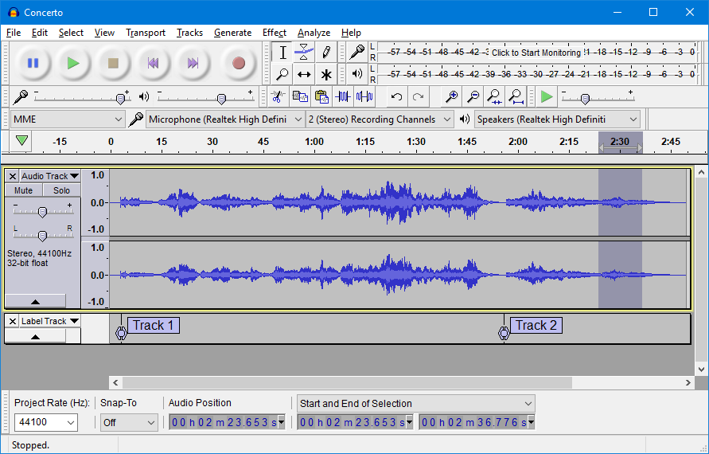
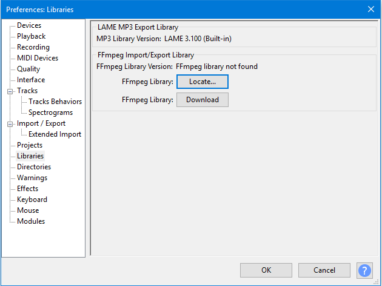
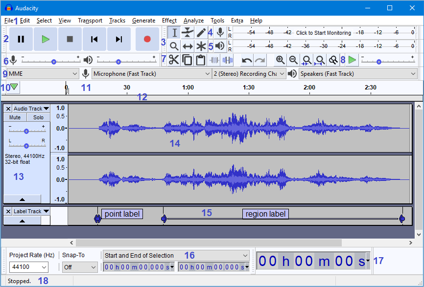
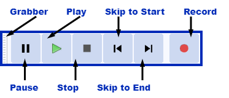
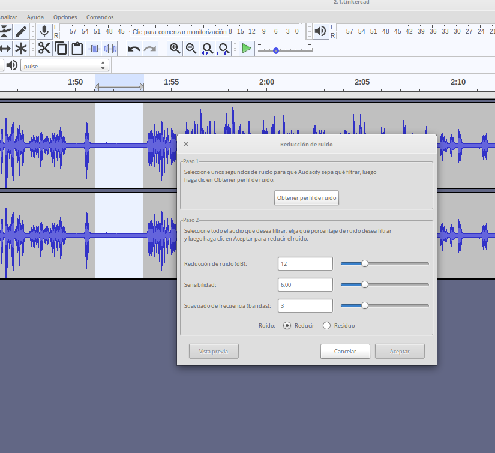
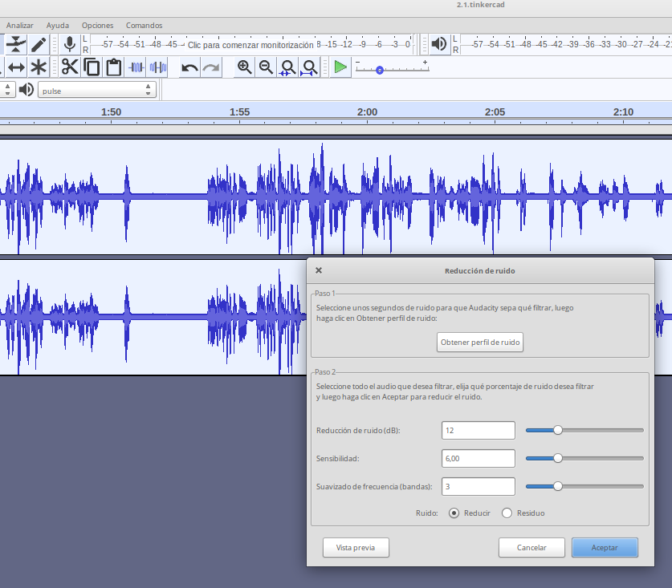
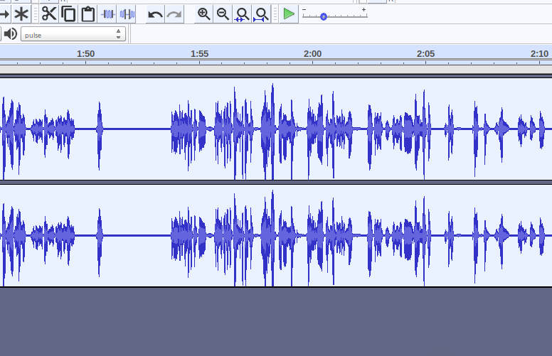

# Audacity

Es un programa de edición de audio semiprofesional que nos va a permitir 
* Grabar audios
* Editarlos:
    * Utilizando filtros y efectos
    * Copiando, cortando y pegando fragmentos
    * Insertando fragmentos
* Sincronizando distintos sonidos
* Mezclándos
* Convirtiendo entre formatos
* Es multiplataforma: Windows, Linux y MacOS

## Instalación

Podemos descargarlo desde su [página de descarga](https://www.audacityteam.org/download/) 

Dependiendo de nuestra instalación puede que necesitemos instalar algunos complementos. 

Por ejemplo para instalar ffmpeg (que se encarga de la conversión entre formatos) en windows podemos seguir [estas instrucciones](https://manual.audacityteam.org/man/installing_ffmpeg_for_windows.html). En Mac lo descargamos desde este [otro enlace](https://manual.audacityteam.org/man/installing_ffmpeg_for_mac.html)

También podemos instalarlos desde la misma aplicación, desde las preferencias. Pulsamos Editar->Preferencias y en la sección de Bibliotecas vemos si está instalado el complemento o hay que instalarlo

[Vídeo: instalación de Audacity y el complemento FFmpeg](https://youtu.be/cjJmk68UuwM)

## Uso

Podemos cambiar el idioma en Editar->Preferencias->Interface->Idioma

Trabajamos con un proyecto:
* Contiene unos medios que colocamos en  pistas
* Los editamos
* Generamos un resultado sonoro

1) Barra de menú
2) Herramientas de transporte
3) Barra de herramientas principal
4) Barra de grabación
5) Barra de reproducción
6) Herramientas de mezcla
7) Barra de herramientas de edición
8) Velocidad de reproducción
9) Caja de herramientas del dispositivo
10) Cursor: marca el lugar de grabación y el punto de reproducción
11) La línea de tiempo
12) La regla Scrub
13) Panel de control de pista
14) Pista de audio
15) Etiquetas
16) Herramientas de selección
17) Barra de tiempo
18) Barra de estado

## Edición

Podemos importar un fichero sonoro y arrastrarlo sobre la aplicación.

La barra de tiempo nos indica la duración del sonido. Podemos hacer zoom usando la rueda del ratón o los botones de la lupa (8)

Controlamos la reproducción con la barra de botones principal

Usamos el ratón para desplazar el cursor

La barra de herramientas nos permite decidir lo que vamos a hacer

Si tenemos seleccionado "Selección"
* Manteniendo pulsado el ratón podemos seleccionar fragmento, que podremos 
    * Copiar, cortar y/o pegar (7)
    * añadir silencio antes y después
    * Silenciar el fragmento

Podemos dividir una pista seleccionando el punto con la herramienta de selección y con la opción Editar-> Recortar -> Dividir (Ctrl + I). También podemos unirlos on Unir (Ctrl+J)

Si tenemos marcado "Desplazammiento" podremos mover los fragmentos y desplazarlos en el tiempo    

Podemos añadir varias pistas a nuestro proyecto. Siendo el resultado final la mezcla de todos ellos

Cuando tenemos varias pistas podemos silenciarlas para así concentrarnos en una de ellas. Cada pista tiene un control global de volumen que podemos usar para conseguir una mezcla de todas ellas a nuestro gusto.

También podemos añadir una pista de etiquetas para añadir anotaciones.

### Grabación

También podemos grabar sonido. Para ello tendremos que seleccionar el dispositivo de grabación (9) y pulsar el botón de grabar. 

Por defecto se graba a continuación de la pista seleccionada. Si creamos una nueva y la seleccionamos se grabará ahí.

### Efectos

Podemos aplicar efectos sobre el fragmento que tengamos seleccionado:

* Eliminar/Reducir ruido
* Amplificar/reducir volumen
* Graves y agudos
* Fade in (hacer que decaiga el volumen)
* Fade out (hacer que se incremente el volumen)
* Eco

### Reducción de ruido

Para reducir/quitar el ruido usamos el efecto "Reducción de ruido" de Audacity. Se hace en 2 pasos:

1. Seleccionamos una parte de la grabación donde no hablamos y haya ruido y pulsamos sobre el efecto "Reducción de ruido" y en el botón "Obtener perfil de ruido". De esta manera se analiza el tipo de ruido.

2. Ahora seleccionamos toda la zona del audio donde queremos reducir el ruido (incluido donde hablamos) y volvemos a pulsar sobre el efecto "Reducción de ruido"

3. Ahora nos saldrá activo el botón "Aceptar" que al pulsar  reducirá el ruido en toda la zona seleccionada.

No siempre el ruido se puede quitar totalmente y casi siempre el proceso resta algo de calidad a la voz. Si vemos que no hemos mejorado siempre podemos "Deshacer" el efecto.

También podemos aplicar el proceso completo varias veces.

## Barras de herramientas

Conviene recordar que si guardamos el proyecto estamos guardando todos los ficheros originales y la modificaciones.

Si lo que queremos es un fichero sonoro con el resultado de nuestros cambios tendremos que hacer una exportación donde podremos elegir el tipo de fichero resultante.

## Documentación

[Manual](https://manual.audacityteam.org/man/tools_toolbar.html)

[Otras barras de herramientas](https://manual.audacityteam.org/man/toolbars_overview.html)

## Recursos

[Vídeo: Edición de audio con Audacity](https://youtu.be/9XGhIBpxjAs)

[Vídeo: Incorporar música a nuestro proyecto con Audacity](https://youtu.be/K7d5YpxsB2I)

### Documentación oficial

[Manual](https://manual.audacityteam.org/)

[Tutoriales](https://manual.audacityteam.org/#tutorials)

[Documentación](https://www.audacityteam.org/help/documentation/)

### Tutoriales

[Tutorial básico para docentes](https://www.edu.xunta.gal/centros/ceipnumero2tui/system/files/Audacity.pdf)

[Tutorial by jesusDA](https://www.jesusda.com/docs/ebooks/ebook_tutorial-edicion-de-sonido-con-audacity.pdf)

[Tutorial Audacity I](https://danivoiceovers.com/tutorial-audacity-funciones-basicas/)

[Tutorial Audacity II](https://danivoiceovers.com/audacity-tutorial-guide-beginners/)

[Tutorial muy completo by J. Antonio Barragán](https://iesrdguezmonino.educarex.es/recursos/manuales/audacity.pdf)

[MegaTutorial by Frank](https://www.lifestylealcuadrado.com/tutorial-de-audacity-en-espanol-el-programa-edicion-audio/)

[Video tutorial de 2 horas de Audacity para docentes](http://jjfrias.com/recursos-educativos-tic-para-docentes#Audacity_Editor_de_audio)

TODO:

Auto duck
Ecualizador