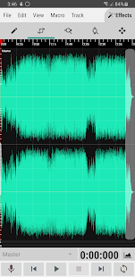
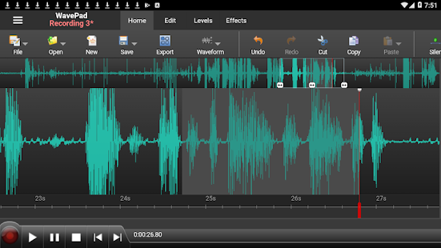

## Edición de audio en móviles

Muchas de las aplicaciones de grabación de sonido, grabadores de notas de voz, etc... incluyen un mínimo de edición, como es recortar el principio o el final de una grabación, pero si queremos hacer algo más tenemos que recurrir a otras herramientas.

Existen muchas aplicaciones para móviles y tablets android que nos permiten editar sonidos, algunas de ellas incluyen publicidad y tienen una versión gratuita pero con la funcionalidad limitada:

[WaveEditor for Android](https://play.google.com/store/apps/details?id=io.sbaud.wavstudio)

[WavePad, editor de audio](https://play.google.com/store/apps/details?id=com.nchsoftware.pocketwavepad_free&hl=es&gl=US)

