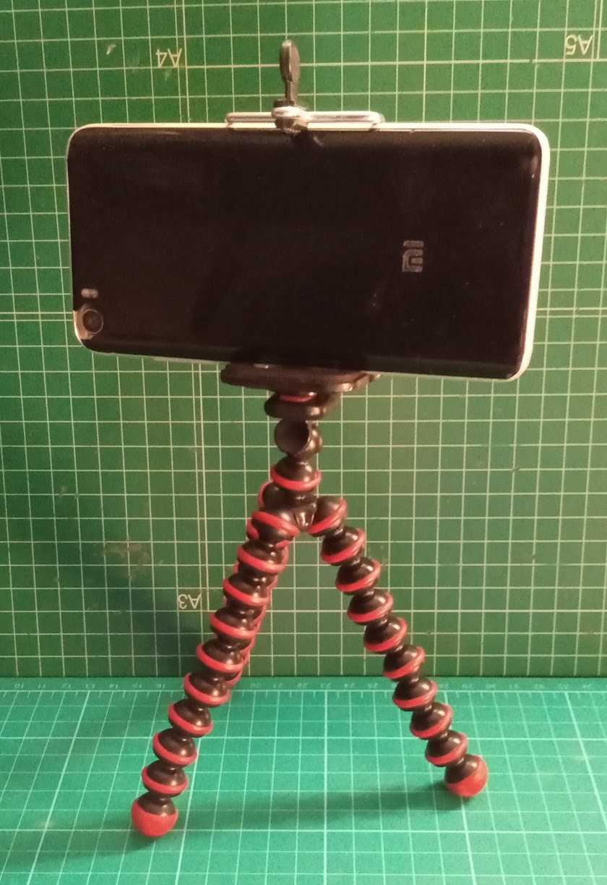
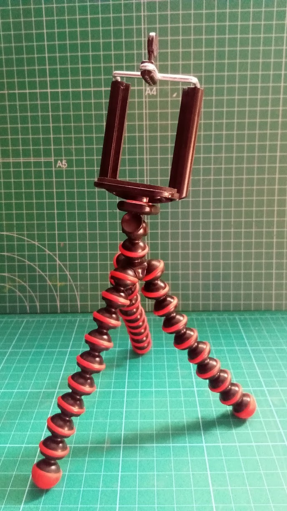

# Grabación de vídeo

Antes de grabar
* Prepara un mini-guión que tendrás a la vista pero que no debes leer. Y si crees que lo necesitas memoriza alguna parte que te resulte difícil
* No debes leer el guión, en todo caso alguna mirada para no perder el hilo,
* Pero sé consciente de que luego puede quitar alguna parte
* Busca un lugar donde:
    * estés cómodo
    * que sea silencioso (nada de ladridos de perros o de vecinos ruidosos)
    * Con buena iluminación (no necesitas una iluminación especial, basta está cerca de una ventana)
    * Elije un fondo que no distraiga a quien vea el público. Si lo necesitas puedes usar una sábana o un poster
    * La cámara debe estar bien fijada y estable 
    * La caḿara debe estar a la altura de los ojos

La cámara
Si lo tiene pon en modo manual (para evitar que cambien a lo largo del vídeo)

móvil
* La calidad de las cámaras de móviles de hoy en día es más que sufiente
* Si es posible usar configuración manual
* Para transferirlo al ordenador usar drive. Cuidado con usar GooglePhotos o whatsapp que reducen la calidad
* Puedes usar un trípode o soporte o una funda que nos permita mantenerlo en posición

Grabación con el ordenador

Grabación en horizontal (salvo que vayas a usar una plataforma como Instagram)

Materiales:
cámara o móvil
trípode o similar

Calidad del vídeo: la máxima disponible

Prepárate para la grabación
* Mírate antes de grabar
* Evita las interrupciones (da mucha rabia tener que repetir algo y además puedes perder el hilo)
	* Avisa a quien te pueda molestar para evitarlo 
    * Pon en silencio tu móvil (acuérdate del fijo)
    * Cierra puertas y ventanas
* Comprueba tu equipo:
    * El micro funciona
    * La cámara está bien enfocada
    * Comprueba lo que va a aparecer en cuadro

