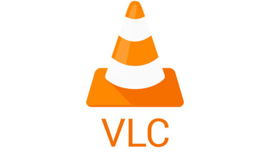

## Reproductores de Vídeo

Como hemos visto existen multitud de formatos de vídeo y muchas variantes de los mismo. Por eso a veces nos encontramos con que no podemos reproducir algún fichero que hemos grabado o descargado.

Para reproducir un determinado formato es necesario tener instalado el *codec* correspondiente, algo parecido a un decodificador de ese formato.

Para resolver este problema podemos instalar un reproductor que ya incluya la mayoría de los codes como es **VLC**.

Podemos descargarlo desde su [página web](https://www.videolan.org/vlc/index.es.html)

Al instalarlo tendremos acceso a la gran mayoría de formatos disponibles.

