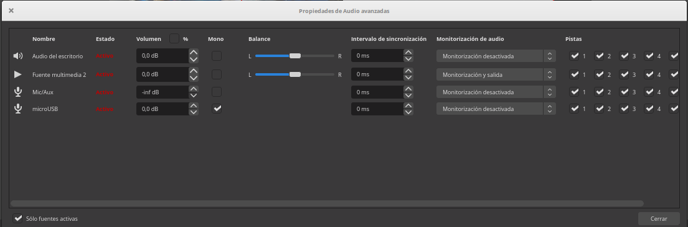
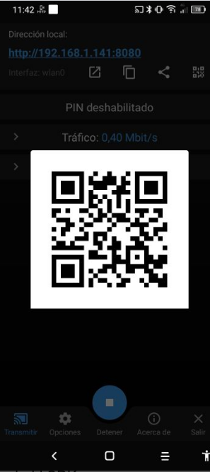

## [OBS](https://obsproject.com/es)

Es un software avanzado de realización y grabación, casi un miniestudio de grabación.

Permite grabar nuestra pantalla, sonido, video o hacer una retrasmitisión, seleccionando qué fuente queremos que se vea en cada momento

Lo usaremos para hacer grabaciones más complejas, donde necesitamos trabajar con diferentes fuentes de audio y vídeo.

También podemos usarlo para emitir en directo, por ejemplo en youtube o en Twitch. 

Nos permite crear una cámara virtual que usaremos con cualquier software de videoconferencia.

## Instalación

[Descarga](https://obsproject.com/es)

## Uso

[Grabación de la pantalla del ordenador (screencast): OBS Studio](https://youtu.be/ytual6vDyus)

## Escenas

Una de las grandes ventajas de OBS es que podemos definir diferentes escenas, cada una con sus diferentes fuentes de vídeo y audio. Durante la grabación podremos usar cada una de ellas en diferentes momentos.

Por ejemplo:
* Definimos una escena de bienvenida, con un rótulo y un fondo.
* Otra escena para cuando empecemos y mostremos el índice de lo vamos a contar, donde se nos ve en una ventana central
* Otra para el grueso de la explicación y donde se ve lo que estamos explicando y una ventanita pequeña donde se nos ve.
* Una escena final con un rótulo de agradecimiento y un enlace a nuestra página

Podemos  añadir nuestro logo:
* imagen con croma y logo
* filtro color croma

Una vez definidas las escenas podemos seleccionar en los "Ajustes" una tecla que activará/desactivará cada escena, para ir cambiando entre ellas durante la grabación.

## Fuentes

Podemos usar como fuentes:

* Vídeo de diferentes Cámaras
* Sonido de micro o de cámara
* Música de fondo (podemos poner en bucle)
* Imagen como fondo o una galería de imágenes
* Cualquier aplicación (por ejemplo para mostrar ppt)
* Páginas web
* Vídeos que tenemos ya grabados
* Textos como banners

Podemos transformar todas las fuentes visuales usando el botón derecho:
* Recortando (pulsando alt)
* Ajustando la posición
* Ajustando el tamaño
* Añadiendo efectos tipo croma

## Ajustes

En ajustes podemos seleccionar las características de la grabación:

* Resolución del lienzo: tamaño de la ventana original. 
* Resolución de salida: tamaño del vídeo que se grabará. Normalmente 1280x720 (720) o 1980x1080 (Full Hd)
* Velocidad FPS
* Bitrate vídeo: calidad del vídeo, tanto en tamaño como el ancho de banda. 
* Bitrate de audio
* Directorio donde vamos a grabar
Estos parámetros están relacionados. Veamos las recomendacione de youtube

|Formato|FPS Estandard (24-30)|FPS Alto (48-60)|
|---|---|---
|1080p|	8 Mbps|	12 Mbps
|720p|	5 Mbps|	7.5 Mbps
|480p|	2.5 Mbps|	4 Mbps
|360p|	1 Mbps|	1.5 Mbps

Para grabar tenemos que tener suficiente espacio

## Configuración de sonido

Además de ver y poder controlar los niveles de sonido de las distintas fuentes en el "Mezclador de sonido", si pulsamos en ajustes avanzados vemos que podemos seleccionar si queremos el sonido en la salida (que es lo que vamos a grabar o a retrasmitir) y/o lo queremos en la monitorización (que es lo que nosotros oímos).

Por ejemplo, si añadimos como fuente un vídeo, por defecto se graba en el resultado pero no se oye. Si escuchamos la grabación veremos que es así.

Si quieres oírlo mientras grabas puedes pulsar en el mezclador de sonido y ahí en la columna de  "Monitorización de audio" seleccionamos "Monitorización y salida"

En este ejemplo he seleccionado esa opción para la fuente multimedia

## Videoconferencias

Podemos compartir la vista generada con OBS por videoconferencia compartiendo la previsualización

Para ellos sólo tenemos que pulsar en "Start virtual cam" y usar esta cámara en nuestro software de videoconferencia

## Usando cámaras de dispositivos externos

Podemos incluir las  cámaras de dispositivos externos en nuestras escenas de OBS con usar simplemente la web **[https://obs.ninja](https://obs.ninja)** en el dispositivo y utilizar la cámara.

[Vídeo: Cómo incluir cámaras remotas en OBS Studio con obs.ninja](https://youtu.be/MjlP6TzFHco)

## Compartiendo la pantalla de un dispositivo móvil 

Para poder compartir la pantalla de un dispositivo móvil en OBS necesitamos poder ver en nuestro PC la pantalla del mismo.

Existen varias formas de hacerlo, instalando diversas aplicaciones o utilizando el comando adb de del android SDK.

Pero hay una solución sencilla que consiste en utilizar un software de videoconferencia, por ejemplo google Meet que nos permita compartir pantalla y desde OBS capturar la venta de esta videoconferencia en el PC.

En Android podemos usar la herramienta gratuita y [opensource](https://github.com/dkrivoruchko/ScreenStream) **[Screen Stream over HTTP](https://play.google.com/store/apps/details?id=info.dvkr.screenstream)**

Tras instalarla, la abrimos en el móvil o tablet y siempre que estemos conectados a la misma red, podemos acceder desde un navegador sin más que abrrir en un navegador la dirección que nos indica la aplicación

También podemos habilitar un código QR para facilitar el compartir la dirección

## Recursos

* [QuickStart](https://obsproject.com/wiki/OBS-Studio-Quickstart)

* [wiki OBS](https://obsproject.com/wiki/OBS-Studio-Overview)

* [Videotutorial 1](https://www.youtube.com/watch?v=nQb2qe9We00)

* [Videotutorial 2](https://www.youtube.com/watch?v=ckWdZ6aoN_0)

## TODO

ver como hacer para compartir la previsualización como si fuera una camara en google meet 

https://www.youtube.com/watch?v=dM-L-XhzNgk

https://www.youtube.com/watch?v=CbgEN9PqgSY

https://www.youtube.com/watch?v=ckWdZ6aoN_0 Blackboard colab

https://youtu.be/5-530vBKZm4

## Alternativas

[Record the screen with ffmpeg and Python](https://pythonprogramming.altervista.org/record-the-screen-with-ffmpeg-and-python/?doing_wp_cron=1606728965.2066988945007324218750)

## TODO:

[Webcam virtual en linux](https://www.youtube.com/watch?v=I-uNsxzalas)