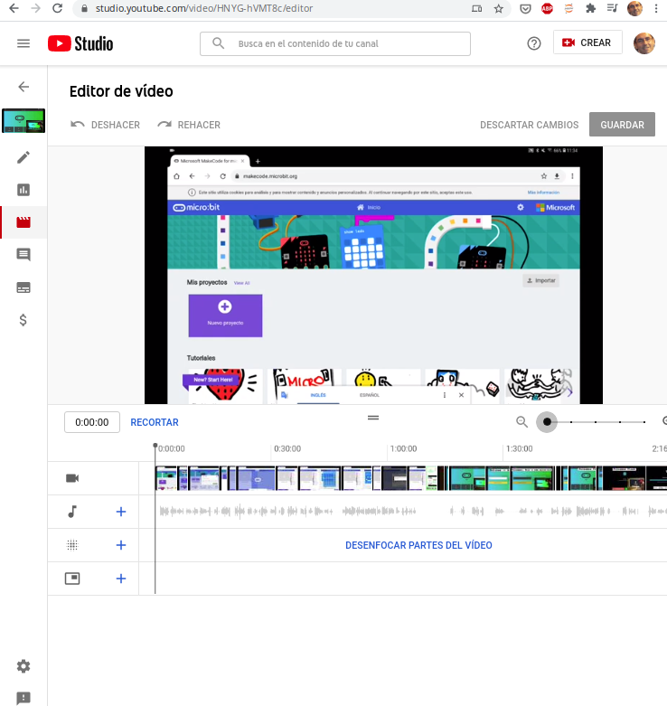

# Publicación de contenidos en Youtube

## Publicación

Publicaremos nuestro vídeo:

* Subiéndolo a youtube
* Añadiremos título y descripción
* Seleccionaremos el nivel de visibilidad:
    * **Público**: todo el mundo puede verlo y aparece en las búsquedas
    * **Oculto**: sólo quien tenga el enlace puede verlo y no aparece en las búsquedas
    * **Privado**: añadimos los usuarios que podŕan verlo, no aparece en las búsquedas

## Editor

Desde nuestro canal pulsamos "Gestionar videos" y seleccionamos el vídeo y pulsamos editar

## Añadir puntos de interés o tiempos concretos

Podemos señalar fragmentos o puntos concretos en el vídeo añadiendo en la descripción comentarios en el formato:

minuto:segundo - Descripción

